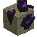
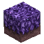

# Blocks and Ores

  

    World route

    # Axo Tales now has both resource nodes and movement-tech blocks

    The world side of the mod is no longer just "mine Arcane Matter." You now have deterministic Arcane Crystals, Kudu-linked resource loops, and two bonus-drop movement blocks that can reshape traversal builds.
  

## Core resource chain

  

    

      
    

    

      <h3>Arcane Matter Ore</h3>
      
Ships in stone and volcanic variants. Both drop Arcane Matter plus the matching cobble type. The packaged defaults still generate both ore families aggressively enough to support regular crafting.

      
<strong>Shipped defaults</strong>: 50% chance per new chunk, target 12 placements, max 256 attempts.

    

  

  

    

      
    

    

      <h3>Arcane Crystal</h3>
      
The big worldgen rewrite after 0.1.147. Crystals now act like routeable surface nodes instead of random clutter.

      
<strong>Shipped defaults</strong>: 64-block density radius, max 1 crystal in that radius, 33% chance, no existing-chunk seeding, legacy cluster pruning enabled.

    

  

  

    

      
    

    

      <h3>Arcane Crystal Shards</h3>
      
The universal premium craft ingredient. They also double as the bonding trigger for Kudu Adepts when dropped nearby.

    

  

## Decorative and movement blocks

  

    

      
    

    

      <h3>Arcane Grass</h3>
      
A builder-facing arcane grass variant with transition textures. It currently drops dirt, so treat it as creative or decorative content rather than a survival farm target.

    

  

  

    

      
    

    

      <h3>Cloud Block</h3>
      
Pass-through, translucent, placeable on floors, walls, or ceilings. It launches up or down based on entry direction and chains at 1.5x per same-direction follow-up cloud.

      
<strong>Shipped defaults</strong>: 6-block target height, 1.0s rearm, 4.0s chain reset.

    

  

  

    

      
    

    

      <h3>Bounce Block</h3>
      
Solid upward-only launch block. Streaked bounces scale from a 4-block target up to an 18-block cap, making it the more predictable vertical route compared with Cloud's directional chaos.

      
<strong>Shipped defaults</strong>: +2 target height per chained bounce, 0.2s rearm, 8.0s streak reset.

    

  

## How the movement blocks enter progression

- Cloud and Bounce Blocks are not standard bench crafts right now.
- Arcane Matter ore can drop one as a bonus at a 25% total chance, split 50/50 between the two block types.
- Kudu Rune Knights and Kudu Adepts can also drop one as a bonus at a 33% total chance, again split 50/50 between Cloud and Bounce.

## Config keys that matter most here

- `worldgen.arcaneCrystalChancePerNewChunk`
- `worldgen.arcaneCrystalPlacementsPerChunk`
- `worldgen.arcaneCrystalDensityRadiusBlocks`
- `worldgen.arcaneCrystalMaxPlacementsPerRadius`
- `worldgen.arcaneMatterOres.stone.*`
- `worldgen.arcaneMatterOres.volcanic.*`
- `cloudBlock.*`
- `bounceBlock.*`
