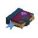
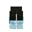

# Axo Tales

  

    
Guidebook

    
Axo Tales is a progression mod built around mana gear, spellbooks, routeable world resources, and Kudu encounters that feed both combat and movement.

    
This guidebook is written for the current line that targets Hytale <code>2026.03.26-89796e57b</code>.

    

      <a class="button-link button-link--primary" href="getting-started/">Start here</a>
      <a class="button-link" href="crafting/">Crafting flow</a>
      <a class="button-link" href="whats-new/">Returning players</a>
    

  

  

    

      
      

        
        
        
        
      

    

  

  

    11
    spellbooks, from healing and blink to mining, taunt, doom, and living light
  

  

    7
    gear pieces that matter right now, including the Sa'r set, Kudu Boots, cloak, and sword
  

  

    2
    movement blocks, with Cloud for directional routing and Bounce for clean vertical chains
  

  

    2
    Kudu encounter lanes: hostile Rune Knights and bondable Adept companions
  

## What defines the mod now

  

    <h3>Spellbooks have clear roles</h3>
    
Healing, teleport, mining, immunity, horde, morph, frost, flame, taunt, doom, and light all have distinct cast timing and a distinct job. The lineup is no longer one generic spellbook loop with different colors.

  

  

    <h3>Mana lives on gear</h3>
    
Axo Tales armor pieces add max mana and mana regeneration, then split into real specialties: movement boots, aquatic diadem, heavy chest, projectile warfists, stealth cloak, and a spellblade sword that still rewards carrying it.

  

  

    <h3>The world feeds progression</h3>
    
Arcane Matter ore, Arcane Crystals, and Kudu drops all push you back into recipes. Cloud and Bounce Blocks then turn spare loot into traversal tools instead of dead-end collectibles.

  

  

    <h3>Kudu content is part of the build</h3>
    
Rune Knights are worth farming for materials and drops, while Kudu Adepts give the mod a companion lane that ties directly into crystal routing and combat support.

  

## Best first clicks

  <a class="card media-card" href="getting-started/" data-reveal>
    

      
    

    

      <h3>Start Here</h3>
      
Install path, first-run files, and the fastest route to a working test build.

    

  </a>
  <a class="card media-card" href="items/spellbooks/" data-reveal>
    

      
      
      
    

    

      <h3>Spellbooks</h3>
      
What every book does, which clicks matter, and which ones changed the most in the current line.

    

  </a>
  <a class="card media-card" href="blocks-ores/" data-reveal>
    

      
      
      
    

    

      <h3>World and movement blocks</h3>
      
Where the resources come from, how the movement blocks behave, and why the world route matters.

    

  </a>
  <a class="card media-card" href="npcs/" data-reveal>
    

      
      
      
    

    

      <h3>NPCs and encounters</h3>
      
Rune Knight rewards, Adept bonding, and the current Kudu loop.

    

  </a>

## Quick install path

  

    1
    <h3>Build or download the current jar</h3>
    
Use an Axo Tales jar built for Hytale <code>2026.03.26-89796e57b</code>.

  

  

    2
    <h3>Install it to the shared mods folder</h3>
    
Put it in <code>C:\Users\&lt;you&gt;\AppData\Roaming\Hytale\UserData\Mods</code>.

  

  

    3
    <h3>Keep one copy and restart if Windows says the jar is locked</h3>
    
Old jars in that folder are the fastest way to test the wrong build by accident.

  

## Returning from an older build

  <h3>If you are coming back from an older Axo Tales build, read the delta page once</h3>
  
The live mod is broader now: crystals are deterministic, the Arcane bench is split into Axo Tales lanes, Kudu content pays back into progression, Taunt can stack into a crater slam, Mining is charge-based, and Light Book exists as a utility lantern spell.

  

    <a class="button-link" href="whats-new/">Open Returning Players</a>
  

