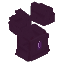
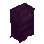

# Gear and Spellblade

  

    Armor identity pass

    # Sa'r gear is no longer just "mana armor"

    The post-`0.1.179` line gave every major gear piece a clearer role: mobility boots, aquatic diadem, heavy chest scaling, projectile Warfists, stealth cloak, and a sword that supports both melee and spellblade play.
  

## Shared Sa'r set baseline

  <h3>Every Sa'r piece now brings real stat value</h3>
  
Each Sa'r armor item grants <strong>+25 max mana</strong> and <strong>+2 mana every 2 seconds</strong>, then layers on the shared set baseline: <strong>+10 stamina</strong>, <strong>+25% stamina regen</strong>, and <strong>+16% physical/projectile resistance</strong>. All current armor pieces also use the longer-life durability pass: <code>MaxDurability=500</code> and <code>DurabilityLossOnHit=0.5</code>.

  

    

      
    

    

      <h3>Sa'r Boots</h3>
      
Best movement piece in the set. Adds +15% move speed, about +2 blocks of jump height, doubled max stamina, and full fall-damage immunity.

      
<strong>Craft</strong>: 4 Dark Feathers, 4 Cobalt Bars, 6 Arcane Crystal Shards, 12 Arcane Matter.

    

  

  

    

      
    

    

      <h3>Sa'r Diadem</h3>
      
The aquatic control piece. Refills oxygen underwater and boosts swim speed and swim jump while keeping the Sa'r mana and defense baseline.

      
<strong>Craft</strong>: 4 Arcane Crystal Shards, 2 Cobalt Bars, 8 Arcane Matter.

    

  

  

    

      
    

    

      <h3>Sa'r Armor</h3>
      
The heavy scaler. Adds +75 health and +25% outgoing physical/projectile damage on top of the shared set stats.

      
<strong>Craft</strong>: 12 Cobalt Bars, 20 Arcane Matter, 10 Arcane Crystal Shards.

    

  

  

    

      
    

    

      <h3>Sa'r Warfists</h3>
      
The active hands slot. While you are unarmed, the initial primary input fires a projectile for 25 damage and a 2-second stun.

      
<strong>Craft</strong>: 2 Azure Kelp, 2 Arcane Matter, 2 Arcane Crystal Shards.

    

  

## Utility and specialty gear

  

    

      
    

    

      <h3>Kudu Boots</h3>
      
Water-walk utility. The boots replace water just ahead and below you with Snow Brick so you can run across lakes, and they still add +25 max mana.

      
<strong>Acquire</strong>: craft them, or farm the Kudu Rune Knight's configurable drop chance.

    

  

  

    

      
    

    

      <h3>Invisibility Cloak</h3>
      
Stealth utility. Hides the wearer from other players, hides visible armor pieces, applies the cloak aura, and best-effort softens non-hostile NPC aggression.

      
<strong>Acquire</strong>: no recipe by default, so treat it as admin, spawn, or curated-loot gear unless you add one.

    

  

  

    

      
    

    

      <h3>Axo's Ancient Sword</h3>
      
Legendary spellblade. Holding it gives you big physical melee damage, a longer charged dash stab, and an RMB Ancient Slash projectile. Carrying it anywhere in inventory also adds +30 max mana.

      
<strong>Craft</strong>: 20 Arcane Matter, 15 Arcane Crystal Shards, 12 Fire Essence, 12 Ice Essence.

    

  

## Current combat numbers worth remembering

- Ancient Sword primary swings: 83 physical base damage.
- Ancient Sword charged stab: 105 physical base damage with a longer forward dash.
- Ancient Slash projectile: 50 damage, 20 mana, 1.25s cooldown, 0.34s cast delay by default.
- Warfists projectile: 25 damage and 2s stun while worn and unarmed.
