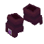
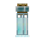
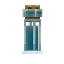
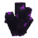
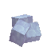

# Arsenal Overview

  

    Everything you can collect or craft

    # Axo Tales now splits cleanly into four loops

    Spellblades, armor, potions, and world resources each feed a different style of play. The post-`0.1.147` releases mostly made those loops clearer, stronger, and easier to route.
  

## Collection map

  <a class="card media-card tilt-card" href="gear.md" data-reveal>
    

      
      
      
    

    

      <h3>Gear and spellblade</h3>
      
Mana scaling, movement tech, invisibility, water-walk, Warfists stun shots, and the Ancient Sword's physical blade plus ranged slash.

    

  </a>
  <a class="card media-card tilt-card" href="spellbooks.md" data-reveal>
    

      
      
      
    

    

      <h3>Spellbooks</h3>
      
Ten books, mostly RMB casts, with LMB alt actions on Healing and Morph plus a big cast-feel polish pass from 0.1.181 onward.

    

  </a>
  <a class="card media-card tilt-card" href="potions.md" data-reveal>
    

      
      
      
    

    

      <h3>Potions</h3>
      
Brewable mobility and power buffs plus a throwable curse vial, all built from Axo's Empty Potion Bottle.

    

  </a>
  <a class="card media-card tilt-card" href="../blocks-ores.md" data-reveal>
    

      
      
      
    

    

      <h3>World resources and blocks</h3>
      
Arcane Matter, density-capped crystals, creative blocks, and the Cloud/Bounce movement pair.

    

  </a>

## The progression shape right now

  

    <h3>Step 1: Find the resources</h3>
    
Mine Arcane Matter ore, harvest Arcane Crystals for shards, and keep an eye out for Kudu drops if you want Frost Book, Kudu Boots, or movement blocks without crafting.

  

  

    <h3>Step 2: Open the right bench tab</h3>
    
The Arcanist's Workbench now separates <strong>Spellblades</strong> from <strong>Armor</strong>, which makes recipe routing much easier than the old mixed setup.

  

  

    <h3>Step 3: Build around mana</h3>
    
Axo Tales armor pieces each add +25 max mana and +2 mana every 2 seconds, while the Ancient Sword adds +30 max mana just by living in your inventory.

  

## Fast inventory checklist

- [Gear & Spellblade](gear.md): Sa'r set, Kudu Boots, Invisibility Cloak, Ancient Sword.
- [Spellbooks](spellbooks.md): Healing, Teleport, Mining, Immunity, Taunt, Horde, Doom, Morph, Flame, Frost.
- [Potions](potions.md): Empty Bottle, Swift, Strength, Rabbit, Invisibility, Curse.
- [Blocks & Ores](../blocks-ores.md): Arcane Matter, Arcane Crystals, Arcane Grass, Cloud Block, Bounce Block.
