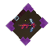

# Spellbooks

  

    Spellbook identity pass

    # The book lineup now has tuned release windows, not one generic cast

    Most Axo Tales books still cast on <strong>RMB</strong>, but the current line adds more personality to every spell: Doom detonates, Taunt stacks, Flame throws faster, Healing and Morph snap harder, and Teleport finally blinks on a clean delayed beat.
  

  <h3>Global rules</h3>
  
Spellbooks are crafted in the Arcanist's Workbench <strong>Spellblades</strong> tab. Most casts are packet-driven server logic with cosmetic item interactions on the asset side, which is why the timing and mana gates feel much tighter than the old early builds.

## Support and utility

  

    

      
    

    

      <h3>Healing Book</h3>
      
<strong>LMB</strong>: fires a Healing Bolt that fully heals the target hit. <strong>RMB</strong>: full self-heal. Default mana cost is 25, with a 0.15s projectile delay on the primary shot.

      
<strong>Craft</strong>: 2 Arcane Crystal Shards, 2 Arcane Matter, 4 Azure Fruit.

    

  

  

    

      
    

    

      <h3>Teleport Book</h3>
      
Blinks you to the solid block you are targeting. Current defaults: 100-block range, 10 mana, and a 0.5s cast delay so the blink lands after the Taunt-mirrored charge animation settles.

      
<strong>Craft</strong>: 2 Arcane Crystal Shards, 2 Arcane Matter, 2 Blue Crystal Shards.

    

  

  

    

      
    

    

      <h3>Mining Book</h3>
      
Breaks a face-oriented 3x3 patch around the targeted block by default, spawns block drops, reaches 12 blocks, and costs 5 mana.

      
<strong>Craft</strong>: 2 Arcane Crystal Shards, 2 Arcane Matter, 10 Volcanic Cobble.

    

  

  

    

      
    

    

      <h3>Immunity Book</h3>
      
Applies a short 3-second damage immunity window and the vanilla Immune effect. Default mana cost is 15.

      
<strong>Craft</strong>: 2 Arcane Crystal Shards, 2 Arcane Matter, 1 Cobalt Shield.

    

  

  

    

      
    

    

      <h3>Horde Book</h3>
      
Summons three short-lived Outlander Brutes that fight for you, retarget attackers, and persist for 30 seconds by default. Mana cost is 25.

      
<strong>Craft</strong>: 2 Arcane Crystal Shards, 2 Arcane Matter, 3 Feran Candles.

    

  

## Control and terrain play

  

    

      
    

    

      <h3>Morph Book</h3>
      
<strong>RMB</strong>: morphs you into the struck target's model. <strong>LMB</strong>: reset back to baseline form. The cast runs at 2x speed in the current fit pass. Default mana cost is 25.

      
<strong>Craft</strong>: 2 Arcane Crystal Shards, 2 Arcane Matter, 2 Dark Feathers.

    

  

  

    

      
    

    

      <h3>Frost Book</h3>
      
Launches a frost shard that slows enemies and converts hit terrain to Snow Brick. Default mana cost is 20, and Rune Knights can drop it.

      
<strong>Craft</strong>: 2 Arcane Crystal Shards, 2 Arcane Matter, 20 Ice Essence.

    

  

  

    

      
    

    

      <h3>Flame Book</h3>
      
Throws a faster fire bolt that burns enemies and converts terrain to Volcanic Rock. Current defaults: 20 mana and a 0.2s dedicated projectile delay.

      
<strong>Craft</strong>: 2 Arcane Crystal Shards, 2 Arcane Matter, 20 Fire Essence.

    

  

## Burst and impact books

  

    

      
    

    

      <h3>Taunt Book</h3>
      
Launches you upward, grants a short fall-immunity window, then slams for area damage on landing. Mid-air recasts stack by 1.5x up to 2000 damage and deepen the crater.

      
<strong>Shipped defaults</strong>: 25 mana, 10-block launch, 6 seconds of fall immunity, 40 base slam damage, 7-block damage radius.

    

  

  

    

      
    

    

      <h3>Book of Doom</h3>
      
The big post-0.1.183 upgrade. The Doom Ball now explodes for 50 damage in a 5-block radius and uses a custom yellow/orange fire burst VFX. Default mana cost is 25.

      
<strong>Craft</strong>: 2 Arcane Crystal Shards, 2 Arcane Matter, 4 Voidhearts.

    

  

## Spell feel notes worth knowing

- Healing and Morph now animate at 2x speed, which makes both books feel much snappier than the older cast loop.
- Teleport deliberately waits longer now. The client cast and server blink no longer race each other.
- Doom and Flame both have their own projectile delay keys, so server owners can tune those two without disturbing every other book.
- Every Axo Tales spellbook now points at its own cast id inside `AxoTales_Spellbook.json`, even if the gameplay logic lives in plugin code.
